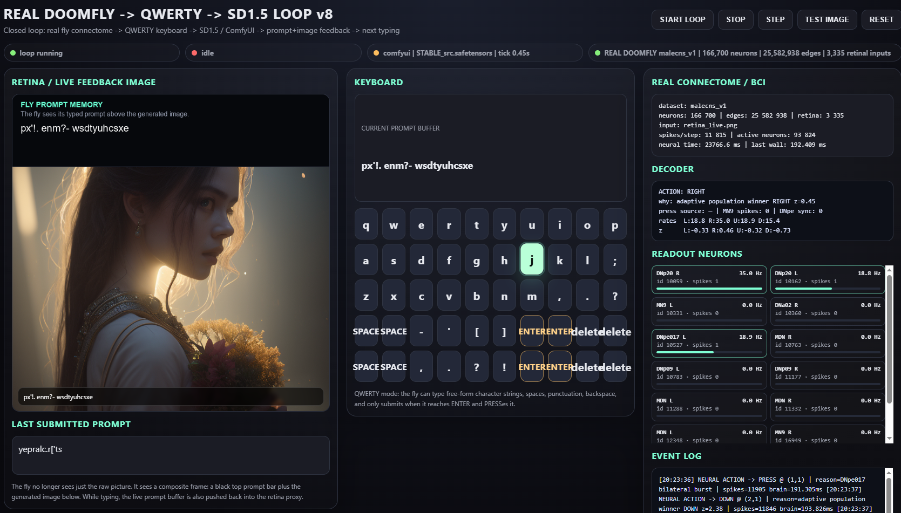

# REAL DOOMFLY -> QWERTY -> SD1.5 LOOP v8

- заголовок обновлён на **v8**
- QWERTY-клавиатура сохранена
- **SPACE** теперь занимает **2x2 зону** (4 клетки квадратом)
- **ENTER** теперь занимает **2x2 зону** (4 клетки квадратом)
- добавлена **DELETE**-зона **2x2** — она удаляет последний символ
- старую кнопку **back** убрал
- retina feedback остался: сверху чёрная плашка с prompt, снизу картинка

## Идея

Теперь важные действия занимают большие зоны:
- SPACE легче поймать
- ENTER легче поймать
- DELETE тоже легко поймать

То есть клавиатура меньше похожа на случайный набор мелких кнопок и больше похожа на штуку, которой реально можно пользоваться в замкнутом цикле.

## Запуск

1. Распакуй архив.
2. Убедись, что ComfyUI работает на `http://127.0.0.1:8188`.
3. Запусти `run_real_brain.bat`.
4. Открой `http://127.0.0.1:8951`.

Если надо просто проверить UI без ComfyUI — запускай `run_mock.bat`.
